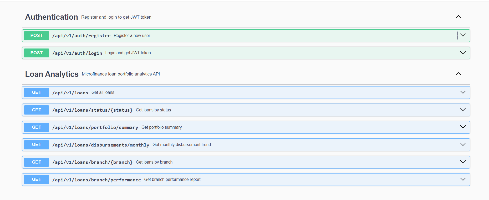
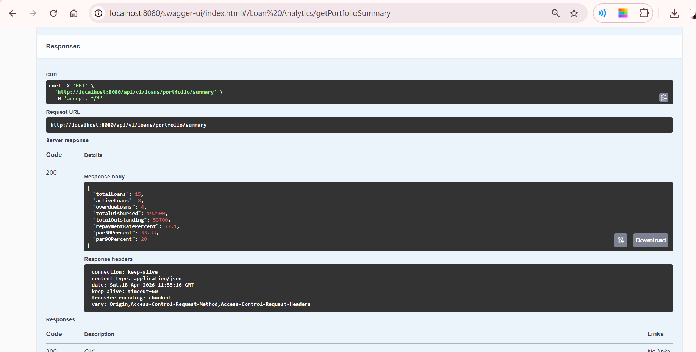
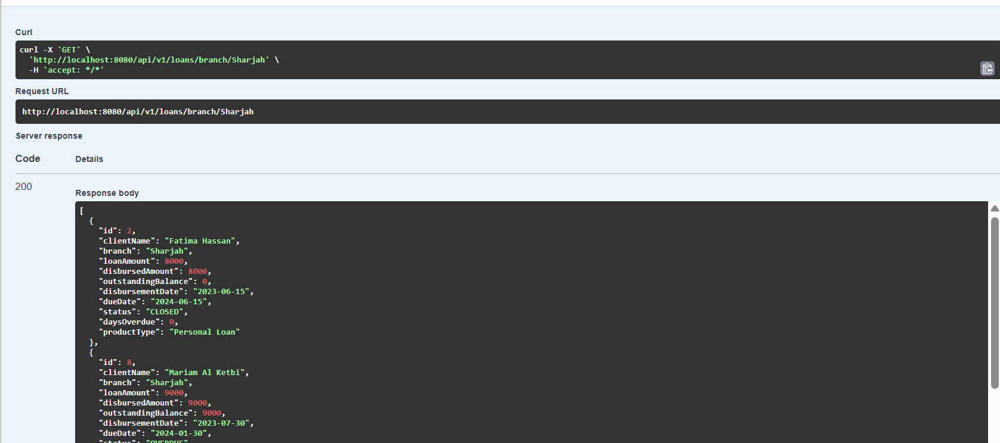
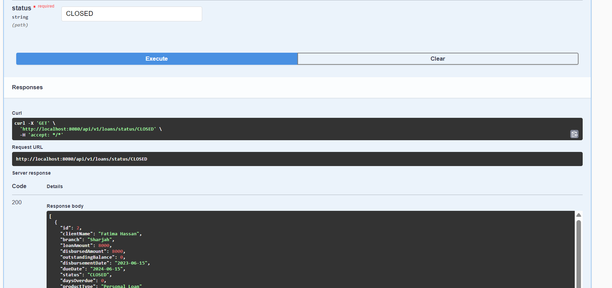
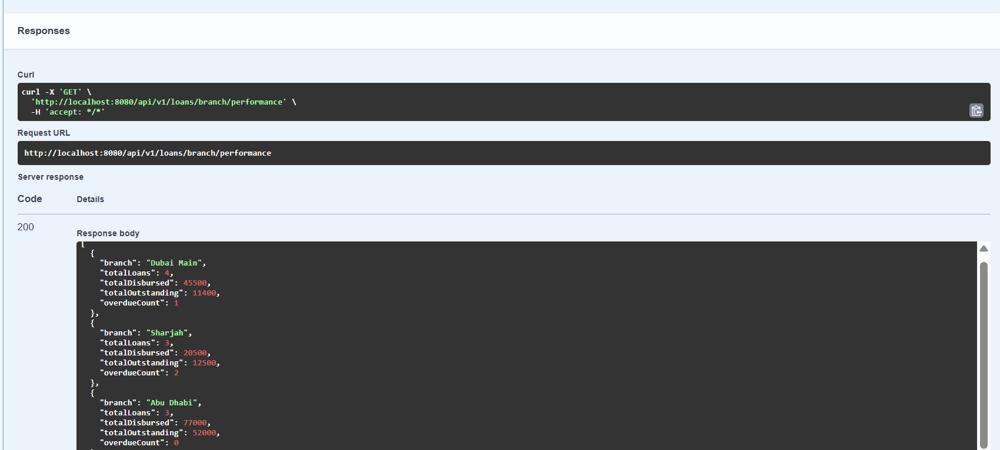

# Fineract Loan Analytics API

A production-ready REST API for microfinance loan portfolio analytics, built on the Apache Fineract data model.

## What It Does

This API powers analytics dashboards for microfinance banks — tracking loan disbursements, repayment performance, portfolio health (PAR30/PAR90), and branch comparisons.

Built by **Gifty Rani R** — Senior Software Engineer with hands-on Fineract experience at Selcom Microfinance Bank, Tanzania.

---

## Tech Stack

| Layer | Technology |
|-------|-----------|
| Language | Java 17 |
| Framework | Spring Boot 3.2 |
| Database | MySQL 8 |
| ORM | Spring Data JPA / Hibernate |
| API Docs | Swagger / OpenAPI 3 |
| Container | Docker + Docker Compose |
| Tests | JUnit 5 + Mockito |
| Build | Maven |

---

## API Endpoints

| Method | Endpoint | Description |
|--------|----------|-------------|
| GET | `/api/v1/loans/portfolio/summary` | Portfolio summary: PAR30, PAR90, repayment rate |
| GET | `/api/v1/loans` | All loans |
| GET | `/api/v1/loans/branch/{branch}` | Loans filtered by branch |
| GET | `/api/v1/loans/status/{status}` | Loans by status (ACTIVE, OVERDUE, CLOSED...) |
| GET | `/api/v1/loans/branch/performance` | Branch performance comparison |
| GET | `/api/v1/loans/disbursements/monthly` | Monthly disbursement trend |

---

## Sample API Response

**GET /api/v1/loans/portfolio/summary**
```json
{
  "totalLoans": 15,
  "activeLoans": 9,
  "overdueLoans": 4,
  "totalDisbursed": 202500.00,
  "totalOutstanding": 99700.00,
  "repaymentRatePercent": 50.79,
  "par30Percent": 26.67,
  "par90Percent": 13.33
}
```

---

## Run With Docker (Recommended)

```bash
# 1. Clone the repo
git clone https://github.com/giftyrani/fineract-loan-analytics.git
cd fineract-loan-analytics

# 2. Start MySQL + API together
docker-compose up --build

# 3. Open Swagger UI
open http://localhost:8080/swagger-ui.html
```

---

## Run Locally (Without Docker)

```bash
# 1. Create MySQL database
mysql -u root -p
CREATE DATABASE loan_analytics;

# 2. Update credentials in application.properties
# spring.datasource.username=root
# spring.datasource.password=yourpassword

# 3. Run
mvn spring-boot:run
```

---

## Run Tests

```bash
mvn test
```

---

## Project Structure

```
src/
├── main/java/com/giftyrani/loananalytics/
│   ├── controller/     # REST endpoints
│   ├── service/        # Business logic + analytics calculations
│   ├── repository/     # JPA queries (PAR, branch aggregations)
│   ├── model/          # Loan entity
│   ├── dto/            # Response objects
│   └── config/         # Swagger configuration
└── main/resources/
    ├── application.properties
    ├── application-docker.properties
    └── data.sql         # Sample loan data (15 UAE records)
```

---

## Key Banking Metrics Explained

- **PAR30** — Portfolio At Risk: % of loans overdue by more than 30 days
- **PAR90** — Portfolio At Risk: % of loans overdue by more than 90 days
- **Repayment Rate** — (Total Disbursed - Outstanding) / Total Disbursed × 100

---

## Author

**Gifty Rani R** | Senior Software Engineer  
Fineract · Spring Boot · Microfinance Banking · REST APIs  
[LinkedIn](https://linkedin.com/in/giftyrani) · r.giftyrani@gmail.com · Ras Al Khaimah, UAE

## Screenshots

### Swagger UI — All Endpoints


### User Registration


### Login with Registered User


### Portfolio Summary (PAR30, PAR90, Repayment Rate)


### Get All Loans


### Loans by Branch


### Loan Status Filter


### Branch Performance Report


### Monthly Disbursement Trend


## Power BI Dashboard

Interactive microfinance loan analytics dashboard built on
the Fineract data model.


**Features:**
- PAR30 & PAR90 portfolio risk metrics
- Disbursement by branch
- Portfolio by loan status
- Outstanding balance tracking
- Interactive branch slicer — filters all visuals instantly